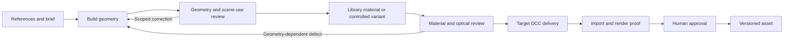

# DCCLoop

**A model-agnostic design for agentic 3D asset production.**

Build, inspect, review and refine an asset against its references, with bounded work, resumable state and a human decision on the delivered result. The goal is to connect different AI models and digital content creation (DCC) tools through explicit contracts. [ESTIMATE]

This first public snapshot contains a reference design, a runnable local **mock controller**, frozen regression fixtures, and an experimental Blender adapter. General model-provider integrations and adapters for other 3D applications remain future work. It is not a production-ready autonomous modeler. [repo prototypes/local/controller/__main__.py:1] [repo prototypes/local/native_adapter/core.py:1]

## The intended loop



The controller owns identities, budgets, receipts, cancellation and evidence freshness. A coordinator scopes work; a builder performs geometry/material jobs; an independent reviewer evaluates the result. Human approval stays separate. This is the proposed production structure, not a claim that every box is implemented. [ESTIMATE]

## What you can use now

| Component | Current scope |
|---|---|
| Local mock controller | SQLite transactions, ownership checks, frozen gate policy, mock workers and public CLI recovery/cancellation. [repo prototypes/local/controller/store.py:66] |
| Regression fixtures | Independent frozen expectations, preserved historical conflicts, positive recovery controls and additional cancellation cases. [repo prototypes/local/fixtures/current_contract/current-contract-v1.json:1] |
| Blender boundary | Experimental finite trusted operations with a separate native run store. It is not an arbitrary-script sandbox or a unified generic agent runner. [repo prototypes/local/native_adapter/core.py:12] |
| Geometry tests | Numerical/mesh predicates with damaged-geometry negative controls; they do not establish reference fidelity. [repo prototypes/local/tests/test_fluted_candidate_v4.py:1] |
| Material catalog, provider adapters, other DCCs | Proposed contracts and roadmap only. [repo docs/roadmap.md:1] |

The retained native source includes a product-specific historical recipe. Its private brief, product imagery, scene files and execution records are excluded; product-mode commands are not a ready-to-run public example. [repo prototypes/local/native_adapter/product_contract.py:34]

## Try the mock loop

Use Python 3.14 on macOS for the documented local verification environment. Other environments need their own validation; Windows process ownership/native hosting are not supported by this snapshot. No API key, external model call, package installation or Blender launch is required for these commands. [repo prototypes/local/controller/store.py:26] [repo prototypes/local/controller/__main__.py:1]

```sh
git clone https://github.com/gregor-em-cg/dccloop.git
cd dccloop/prototypes/local

python3 -B -m controller demo --run runs/quickstart
python3 -B -m controller status --run runs/quickstart
python3 -B -m controller resume --run runs/quickstart
```

This operates on synthetic text artifacts and stops according to mock policy. It does not create a 3D asset. [repo prototypes/local/controller/__main__.py:20]

To inspect cancellation after a mock worker completes:

```sh
python3 -B -m controller demo --run runs/cancel-example --job-kind review
python3 -B -m controller cancel --run runs/cancel-example
python3 -B -m controller resume --run runs/cancel-example
python3 -B -m controller status --run runs/cancel-example
```

Use a new run directory for a new experiment. Keep prior run evidence; do not delete consumed counters to continue a stopped run. [repo prototypes/local/controller/store.py:246]

## Verify the snapshot

From the repository root:

```sh
python3 -B tools/check_frozen.py
python3 -B tools/run_checks.py
```

The complete local check runs mock Python subprocesses, simulated native-guard inputs and geometry unit tests. It does not dispatch Blender or a provider. It writes ignored raw reports under the prototype and a public-safe summary at `verification/local-test-results.json`. See [testing](docs/testing.md) for the distinction between current acceptance, retained failures and actual process injection. [repo tools/run_checks.py:1]

The lightweight GitHub workflow checks frozen inputs and portable geometry predicates only. It is not the full controller, native or visual acceptance suite. [repo .github/workflows/checks.yml:1]

## Design and contribution entry points

- [Architecture and authority](docs/design.md)
- [Model-provider and DCC adapter contracts](docs/adapter-contract.md)
- [Reusable materials and controlled variants](docs/materials.md)
- [Development roadmap](docs/roadmap.md)
- [Conceptual pressure tests](docs/pressure-tests.md)
- [Independent review prompt](docs/review-prompt.md)
- [Studio workflow questions](docs/studio-profile-questions.md)
- [Testing and known limitations](docs/testing.md)
- [Preserved policy corrections](docs/history.md)

Start with a concrete failure case or a small adapter capability with independently authored acceptance criteria. Avoid adding permanent agents simply to mirror workflow stages. [ESTIMATE] See [CONTRIBUTING.md](CONTRIBUTING.md).

## Public snapshot and license

This repository is a curated source/design snapshot. Private runtime databases, raw session/accounting logs, commercial reference photographs, model binaries and historical delivery archives are excluded. `verification/SOURCE_PROVENANCE.json` records byte-preserved source selections; originals remain outside this repository. [repo verification/SOURCE_PROVENANCE.json:1]

MIT licensed; see [LICENSE](LICENSE). External applications and third-party assets are not bundled or relicensed by this project. [repo LICENSE:1]

Evidence notation: `[repo path:line]` identifies source, `[obs]` marks a recorded execution in its stated environment, and `[ESTIMATE]` marks a proposal/inference. Reading code is not running a test; successful file delivery is not visual acceptance.
