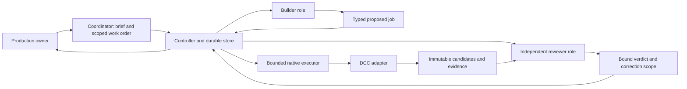
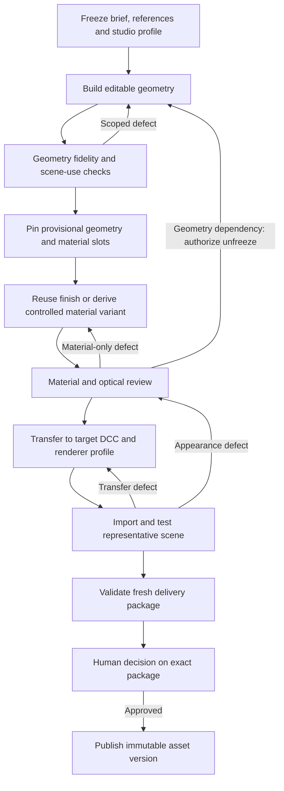

# DCCLoop design

DCCLoop is a working design for a resumable reference-to-3D asset loop. Its intended separation is model reasoning, durable orchestration, and digital content creation (DCC) adapters. Supporting additional models and DCC applications is a development goal, not a compatibility claim. [ESTIMATE]

Read the [roadmap](roadmap.md) for proposed stages and [pressure tests](pressure-tests.md) for counterexamples. In these documents, `[repo path:line]` identifies inspected source and `[ESTIMATE]` identifies a proposal or inference. Source citations do not claim the code was executed.

## What exists and what is proposed

The local mock store uses SQLite transactions, pinned policy/profile hashes, ownership epochs, and append-only event and receipt records. Receipt adoption verifies the intent, attempt, adoption authority, and referenced artifacts. These are useful implementation anchors for the design. [repo prototypes/local/controller/store.py:66] [repo prototypes/local/controller/store.py:94] [repo prototypes/local/controller/store.py:206]

The prototype's quality reviews are structured mock inputs; matching an input contract does not establish that a model can judge an image correctly. The review guard binds required reviews to the current candidate, bundle, profile, scope, and round. [repo prototypes/local/controller/policy.py:51]

The production workflow below proposes material-library governance, target-scene performance checks, cross-DCC delivery validation, and provider-independent boundaries. It must not be read as a list of implemented capabilities. The experimental native adapter is a separate finite local execution path, not proof of a unified generic pipeline. [ESTIMATE]

## Smallest useful architecture

Retain one authoritative controller/store, a serialized executor for each exclusive native resource, and three scheduled reasoning roles: coordinator, builder and independent reviewer. The coordinator prepares the brief and scoped work orders; deterministic controller policy retains dispatch authority. Geometry and material work are job types of the builder. Library lookup, naming checks, accounting and packaging need no permanent reasoning agents. A human production owner retains approval authority. [ESTIMATE]

The controller decides what may run; reasoning outputs propose work or report evidence. A role name alone does not prove independence. Define context isolation, access restrictions, model/provider identity, and escalation before relying on a reviewer as an independent control. No extra agent is justified solely because a box appears in the diagram. [ESTIMATE]

## Asset lifecycle

All lifecycle gates above are proposed acceptance boundaries, not replacements for existing prototype gate identifiers or historical test expectations. Diagnostic renders can occur throughout the process; the final renderer belongs to the studio profile. [ESTIMATE]

### Geometry-first is provisional

A geometry gate should establish dimensions, silhouette, part structure, editable construction, material-slot identity, intended topology, transforms, and suitable scene cost. Its criteria depend on asset class and intended camera distance. A mesh count alone proves neither quality nor efficiency. Do not impose a universal triangle cap, closed-surface rule, or modifier policy without a use case and benchmark. [ESTIMATE]

Transparent, reflective, displaced, or thin materials can expose geometry defects that neutral shading misses. A downstream defect should request a scoped geometry revision, preserve the prior candidate, and invalidate dependent evidence. It must not silently mutate a protected asset or continue material edits indefinitely. A permitted material-only adjustment can retain geometry evidence only if its dependency checks remain satisfied. [ESTIMATE]

### Separate verdicts

Record execution success, geometric suitability, visual fidelity, target-scene compatibility, package integrity, and human approval separately. A valid archive, successful render, or majority review must not override a mandatory failed criterion. An asset can be useful for diagnosis while remaining unapproved for production. [ESTIMATE]

Bind acceptance to exact brief, candidate, material dependencies, studio profile, adapter/renderer versions, settings, and evidence identities. A newly exported artifact is a distinct delivery identity even if its semantic asset ID is unchanged. Preserve old decisions rather than rewriting them when inputs or policies change. [ESTIMATE]

## Recovery and bounded refinement

In the mock implementation, cancellation is committed under the normal ownership check before worker termination is attempted. Unknown or mismatched process identity avoids signalling. Receipt adoption and accounting are transactional, and cancelled completions become inapplicable to further progress. [repo prototypes/local/controller/store.py:246] [repo prototypes/local/controller/store.py:206] [repo prototypes/local/controller/policy.py:203]

Preserve these invariants through each adapter. A cancelled run can collect late evidence and consumption without launching follow-up work. A worker with an unknown outcome must not be treated as never launched. Atomicity inside one store does not imply atomicity across native files, process launch, and separate budget stores; test those crash boundaries explicitly. [ESTIMATE]

Reserve finite attempts, native time, model usage, review repairs, and finalization capacity before dispatch. Separate creative revisions from technical retries. Repeated failure should trigger a bounded change of method or a human decision, without resetting cumulative budgets. Usage estimates and actual receipts remain distinguishable. [ESTIMATE]

## Extension points

Use the [adapter contract](adapter-contract.md) to declare capabilities and failure behavior. Use a versioned studio profile for the target DCC, renderer, units, naming/tree rules, material authority, performance limits, and approvals. Model/provider changes should alter a role adapter without granting it control over policy or native execution. The minimum next evidence is one chosen asset reaching an actual target-side validation under a pinned profile. [ESTIMATE]
