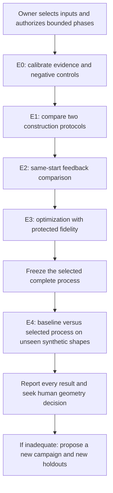

# Geometry experiment commission v1

**Status: products selected; execution intake pending.** Use exactly **Joriel Vase (D01)** and **Ziven Bowl in Blue (D02)**, as selected by the owner. Their sourced dimensions, inspected reference features and missing evidence are in [SELECTED_PRODUCTS.md](SELECTED_PRODUCTS.md). The campaign below is a proposal, with no new modeling results; image freezing, model choices, monetary/token ceilings, execution phases and asset-specific tolerances remain intake decisions. [ESTIMATE]

## Objective

Find a small, repeatable process that produces faithful, editable, scene-efficient geometry from selected reference images. Compare how the asset is constructed, how corrective feedback is supplied, and how geometry is optimized. Then test the chosen process on unseen synthetic geometries under locked rules. Report development quality on the two real products separately from synthetic transfer. Deliver either a qualified process for the tested scope, or a useful failure/inconclusive result with a specific next hypothesis. Do not promise that unlimited iterations will reach quality. [ESTIMATE]

The first native execution environment should be Blender, after capability checks. Keep the experimental records model/DCC-neutral; keep the builder/reviewer versions fixed within a comparison. Other model providers, DCCs, material development, photorealistic rendering and production qualification are later experiments. [ESTIMATE]

## Existing starting point

The repository supplies a mock controller with transactions, owned cancellation and receipt reconciliation, plus a separate finite native adapter. The native adapter has a fixed Blender application path and product-specific routes; it is not already a generic reference-to-geometry experiment runner. [repo prototypes/local/controller/store.py:66] [repo prototypes/local/controller/store.py:246] [repo prototypes/local/native_adapter/core.py:12] [repo prototypes/local/native_adapter/product_contract.py:34]

Keep the coordinator, builder and independent reviewer roles. The coordinator scopes work and records decisions; the controller owns dispatch/accounting; the builder creates geometry; the reviewer supplies/evaluates evidence. A human CG reviewer decides whether the proposed geometry quality is useful. No new permanent role is required for each phase. [repo docs/design.md:17] [ESTIMATE]

Once execution is separately authorized, the agent may add the minimum isolated experiment harness, inspection/capture recipe and trial records needed to perform this campaign. Keep original runtime/policy/fixtures and historical runs unchanged. Do not spend the campaign designing a new general framework, replace ownership guards, or dispatch arbitrary generated scripts through an unverified boundary. A needed capability must be implemented/tested as a narrow trusted operation before using it for a measured trial. [ESTIMATE]

## What counts as geometry work

Include dimensions, proportions, silhouette, part anatomy, contacts/gaps, curves and surface detail, topology, normals, transforms, editable construction, stable part identities and scene cost. Use explicit geometry for features the brief says must survive in the model. [ESTIMATE]

Use fixed neutral/clay, wire and grazing-light diagnostic views. Rendering these views is measurement support, not a material/render-quality project. No textures, normal maps, displacement shaders, opacity tricks or per-candidate lighting/camera tuning may make geometry appear to improve. A fixed extra diagnostic shader is permitted only if preregistered for every relevant candidate; its appearance is not a material-fidelity score. [ESTIMATE]

Do not implement the material library, match brass/fabric/glass, choose a production renderer, build a Max adapter, manufacture an asset, or refine a prior product implicitly. Record useful future material slots and scene structure, but stop this campaign at geometry. A source-side scene benchmark cannot prove target-DCC production performance. [ESTIMATE]

## Intake and release of work

Complete [RUN_APPROVAL_TEMPLATE.json](RUN_APPROVAL_TEMPLATE.json) as an owner-approved run record before native/model execution. A planning agent may inventory capabilities and prepare files, but must leave authority/unknown values unset instead of authorizing itself. Existing historical approvals do not approve this new campaign. [ESTIMATE]

Required before measured trials:

- Freeze image files/hashes and permitted use/sharing scope for the two already-selected products; product selection is complete, reference-packet freezing is not. Do not silently select an old lamp/chair or use a finished model as the builder's starting asset.
- Builder/reviewer model versions, settings and execution mechanism; approved paid-use limits if applicable. If cost cannot be measured/reserved, paid dispatch is blocked.
- Installed DCC/version, machine profile, trusted operation boundary, preservation roots and separate campaign ledger.
- Geometry profile: intended uses/distances, known dimensions and uncertainties, protected details, applicability, editability task and scene-use limits.
- Pinned reference/view/evaluator versions; owner/CG decision authority; authorized phases and aggregate limits.

The proposed first release of execution is E0 and E1, followed by a short findings checkpoint. The owner can instead authorize E0–E4 together within the frozen aggregate budget. Once a phase is authorized, continue ordinary work inside its limits without asking before each command. Stop only on a real missing prerequisite, violated guard, exhausted budget or required scope change. [ESTIMATE]

## Benchmark and information boundaries

| Set | Proposed content | Who can see what |
|---|---|---|
| Calibration C01–C02 | Contributor-owned synthetic shapes with exact dimensions and target geometry, matching the declared geometric problem families | E0 uses known valid and corrupted variants to calibrate measurement; these are not creative comparison trials |
| Development D01–D02 | Joriel Vase and Ziven Bowl in Blue; vessel proportions, repeated relief, rims, cavities and detail contacts | Builder gets the frozen images and sourced dimensions; photographic uncertainty remains explicit; no finished product mesh is supplied |
| Validation H01–H02 | Two unseen synthetic geometries from the same declared families, not trivial copies with identical parameters | References released only after process lock; hidden target data remains evaluator-only |

Both commercial products are development assets. H01/H02 are synthetic transfer tests, not additional selected products. No third commercial product is required. Report real-product development acceptance and synthetic transfer separately; this design does not test unseen-commercial-product transfer or establish performance across furniture, organic forms or all 3D tools. Add new families only in a later versioned campaign. [ESTIMATE]

Seal hashes and custody of H01/H02 before tuning. A human/isolated evaluator should hold the hidden target geometry and final labels. Fresh model context alone is not proof of secrecy; use separate artifact access and record any exposure. If separation cannot be enforced, mark the evaluation leakage-limited. Do not call those results independent held-out proof. [ESTIMATE]

Use two fresh runs per condition. Pair repeat IDs and seeds where the backend supports them; otherwise record seed control as unavailable. Repeated runs measure variability on the same asset; they do not become additional independent products. Randomize/counterbalance arm order within matched blocks and retain failed/discarded attempts. [ESTIMATE]

## Campaign sequence

### E0 — Prove the evaluator can reject bad geometry

Before comparing creative methods, build the known fixture/reference/evaluation packets and freeze [GEOMETRY_RUBRIC.md](GEOMETRY_RUBRIC.md). Include valid positive controls and deliberately wrong dimensions, missing/shifted parts, collapsed geometric detail, broken normals/topology where applicable, stale/mixed evidence, and a legitimate open surface that must not fail a blanket watertightness rule. Each control must have an independently recorded expected verdict. [ESTIMATE]

Verify dimension readback, immutable candidate/evidence identity, frozen captures and a simple edit-and-restore task. For synthetic fixtures, expose the target mesh only to measurement. For photographs, freeze camera/alignment assumptions and uncertainty before comparison; unknown-camera image similarity is not exact geometric ground truth. [ESTIMATE]

Do not proceed if wrong geometry passes, valid geometry is rejected for an inapplicable rule, or the evaluator cannot bind evidence to the right candidate. Correct and version the evaluation contract for a reason independent of the builder; retain the failing control and rerun calibration. [ESTIMATE]

### E1 — Construction screening

Compare two protocols, with the same references, tool access, evaluator, model/settings and resource ceilings: [ESTIMATE]

- **A0, direct construction:** the builder constructs one candidate from the reference brief with its normal workflow. It may reason normally; do not deliberately handicap it or forbid ordinary planning.
- **A1, explicit anatomy and measurement scaffold:** before construction, write a part/relationship map, sourced dimension table, uncertain fields, geometric representation choices and a coarse-to-fine plan. Check silhouette/proportions/negative space before committing decorative detail. Charge planning and intermediate tool work to the same trial budget.

Two development products × two protocols × two fresh repeats = **8 initial build passes**. One submitted candidate per trial; exploratory/failed native work and reasoning still consume the trial's attempt/time/cost limits. Saving only the last candidate cannot hide prior creative drafts. [ESTIMATE]

This comparison tests the construction protocol, not which provider is smartest. Record representation choices (primitives/modifiers, curves/lofts, direct mesh, etc.) as explanatory data. Do not silently change model, evidence profile or budget between A0/A1. Choose one global construction protocol using the decision rule below; asset-specific routing requires a separately frozen rule and evidence. [ESTIMATE]

### E2 — Equal-budget feedback ablation

For each D01/D02 repeat, fork the **identical E1 snapshot from the selected construction protocol** into two branches. Record the shared parent hash. [ESTIMATE]

- **F0, active self-review control:** the builder sees the standard proof packet and performs its own diagnosis before one corrective pass.
- **F1, independent structured feedback:** a separate reviewer sees the same permitted evidence, produces numbered image callouts with geometric diagnoses and priorities, and the builder performs one corrective pass.

Two fixtures × two repeats × two feedback conditions = **8 correction passes**. Both branches get one correction and the same combined builder-plus-advisory-review ceilings. Give F0 the same opportunity to inspect evidence and spend its budget. Extra critique tokens/time in F1 are recorded costs, not free work. [ESTIMATE]

Every branch gets the same independent final evaluation. Hide builder rationale, branch labels and previous scores from that evaluator. Advisory feedback and final scoring are separate events/contexts; the advisor cannot change the rubric or certify its own proposed fix. Blinded human ratings and synthetic measurements provide evidence beyond another model's opinion. [ESTIMATE]

### E3 — Optimize without hiding a quality regression

Use the preregistered repeat-1 final candidate from the selected E2 feedback branch for each development fixture. Compare the unchanged candidate to one geometry-optimization pass per fixture: **2 additional passes**. [ESTIMATE]

Freeze one applicable optimization policy before these passes: for example, reduce unnecessary tessellation while protecting high-curvature features, or replace repeated identical parts with instances. State what may change and what must remain. No free-form new styling, invented universal polygon cap, or camera change. [ESTIMATE]

Measure fidelity at the same views/scale, editability, evaluated geometry/object counts, memory/load/inspection timing and a fixed replicated-asset scene. Repeated scene instances are a load test, not extra benchmark assets. Use warm-up plus repeated timed measurements and report the range/median on the named machine. If no target-scene budget is supplied, record diagnostic performance only; do not claim scene-readiness. [ESTIMATE]

An optimization enters the selected process only if all fidelity/editability gates remain satisfied and a preregistered performance objective improves. Otherwise keep the unoptimized candidate and explicitly reject that policy. The raw candidate is preserved in either case. [ESTIMATE]

### E4 — Locked validation on unseen synthetic geometries

Freeze the complete selected process, including representation-selection rule, prompts, review format, stopping policy, any optimization, tool/model/profile versions and candidate-selection rule. Use its file hash as the process identity. Resolve selection fields in [EXPERIMENT_PLAN.json](EXPERIMENT_PLAN.json) without altering earlier trials. [ESTIMATE]

Compare **P0 = A0 + F0, no optimization** against **P1 = selected A + selected F + accepted optimization, if any**. Each process receives one initial build and at most one corrective pass. If P1 uses optimization, it must fit within that corrective pass and the same total allowance; E3 does not earn a third free validation pass. If the selected process is identical to P0, record no differentiated challenger and stop or revise the design before unsealing holdouts. [ESTIMATE]

Two unseen synthetic assets × two processes × two repeats = **8 validation traces**, each at most two build passes: **16 passes maximum**. Use fresh starts; no imported development candidate or hidden target mesh. [ESTIMATE]

Within-trial feedback is allowed exactly as the frozen P0/P1 process specifies. It uses the builder-visible references only. Hidden-view/target measurements and final validation scores remain sealed until all validation traces finish. Do not change prompts or methods between repeats using earlier holdout outcomes. Exposed/tuned-on holdouts become development data and require replacements for a new confirmatory campaign. [ESTIMATE]

## Durable work and learning record

Follow [LOGGING_CONTRACT.md](LOGGING_CONTRACT.md) throughout execution. Log every attempt and revision as it happens, including failed/discarded work, what changed, what worked or failed, the evidence-supported explanation or hypothesis, and lessons for the next campaign. Record tokens and wall/active/native time by product, phase, trial, revision and role; preserve raw sources, separate shared work and mark estimates/unknowns explicitly. Deliver both the machine-readable ledger and a completed [learning report](LEARNING_LOG_TEMPLATE.md). This is a required output, not optional end-of-task narration. [ESTIMATE]

## Resource ceilings and stopping

Proposed maximum: **8 + 8 + 2 + 16 = 34 creative build passes**, with 26 trial rows in [TRIAL_MATRIX.csv](TRIAL_MATRIX.csv). A failed, interrupted or discarded creative attempt still consumes its allowance. A lineage is at most initial + one correction + one development optimization; repeated trials never erase aggregate consumption. [ESTIMATE]

Proposed operational caps, requiring owner approval: 15 active minutes per creative pass; 10 active hours for the whole campaign (34 × 15 + 90 = 600 minutes), including a 90-minute final evaluation/report reserve; 200 native jobs (34 × 5 build support + 10 calibration + 20 reserved finalization); 180 measured native minutes in aggregate; 300-second native-job timeout; at most one identical technical retry per logical job and six in the campaign, all inside existing caps. These are finite planning ceilings, not predicted completion times or calibrated requirements. E0 and coordination overhead also consume the campaign ceiling, so the arithmetic does not guarantee every pass fits. The separate 180-minute native-runtime cap is not derived from the pass count. Stop at the first binding limit. [ESTIMATE]

Token/dollar caps, proof resolution, performance thresholds and hardware limits must be filled and frozen before dispatch. Preserve actual provider usage, cached-input breakdown when available, native runtime and wall time separately. Unknown usage is neither zero nor a refund. Report creative production cost, advisory review cost, offline evaluation cost and the combined total. Never report an API-equivalent estimate as an invoice. [ESTIMATE]

Stop immediately for unauthorized input/output changes, lost provenance, unverified process signalling, compromised evaluation separation or accounting/cancellation loss. An ordinary visual failure is data: finish its bounded trace and record it. After two unchanged mandatory blockers on the same lineage, stop that lineage and propose a different causal approach; no unbounded parameter tweaking. [ESTIMATE]

If a paired block cannot be completed, retain both attempted/missing conditions, identify the reason, and exclude it from a paired difference while still reporting failure/consumption. Do not drop failed trials from headline success counts. Budget-driven missing trials make the campaign incomplete, not successful. [ESTIMATE]

## Decision rules

Use hard criterion verdicts and per-asset results, not a beauty-weighted average. The [rubric](GEOMETRY_RUBRIC.md) defines required acceptance and uncertainty handling. Select protocols in this order: [ESTIMATE]

1. Disqualify integrity/authority violations and unexplained mandatory regressions.
2. Prefer more development cases/repeats satisfying every applicable requirement.
3. If neither reaches acceptance, compare mandatory defect severity/count and paired fidelity/editability changes; label the choice exploratory, never approved.
4. Use scene performance and measured total cost/time as tie-breakers under the same quality requirements. A negligible/ambiguous difference retains the simpler baseline.

For E4, publish each pair/repeat and disagreements. Compare per-asset acceptance, defect reductions, editability and performance/cost; views, vertices and repeated runs are not independent products. A small benchmark is descriptive and does not establish an industry success rate or statistical superiority. [ESTIMATE]

Call the revised process **qualified for this benchmark** only if all applicable hard requirements pass on every P1 validation trace, the preregistered selected D01/D02 development deliverables pass applicable requirements and receive explicit human geometry approval, no planned P0/P1 trial is missing, and no protected regression is hidden. This combines development acceptance on two real products with transfer evidence from four P1 synthetic traces; it is not validation on unseen real products. P0 failures remain valid comparison data; they do not themselves disqualify P1. Claim **better than baseline** only if the preregistered paired decision supports it; equal quality at lower measured cost may support an efficiency claim with the same limitations. Otherwise report failed, mixed or inconclusive and propose the next bounded hypothesis. [ESTIMATE]

Select each D01/D02 delivery by the chosen global construction/feedback protocol and the preregistered repeat-1 lineage; retain its E3 result only if that optimization passes the protected-fidelity rule. Do not quietly substitute a better-scoring repeat. If a different delivery selection rule is needed, freeze it before E1 and label any later change exploratory. [ESTIMATE]

## Deliverables from the executing agent

1. Frozen intake/authorization, experiment plan, fixture identities, evaluator/calibration controls and process versions.
2. Every attempted candidate, source recipe, native inspection, immutable proof bundle and before/after annotated comparison; originals preserved.
3. Trial/event ledger: parent/candidate hashes, model/tool versions, seed availability, status, counters, timing, usage/cost provenance, failures and skipped work.
4. Per-criterion independent evaluation and blinded human decision, with uncertain/not-assessable cases retained.
5. A results table using [RESULTS_TEMPLATE.csv](RESULTS_TEMPLATE.csv), paired plots/tables, accepted/rejected hypotheses and a concise next-agent recipe.
6. A full work/revision/learning log and reconciled token/time breakdown required by [LOGGING_CONTRACT.md](LOGGING_CONTRACT.md); include failed approaches and evidence-based lessons for future refinement.
7. A final report distinguishing executed native work, simulations, source inspection and proposals. Provide the best eligible geometry package **with its actual status**, not an implied approval.

Store selected product inputs and output models in a separate private/disposable campaign location unless publication rights are explicit. The public repository should receive only shareable synthetic fixtures, code/docs and appropriately sanitized evidence. Stop at the authorized campaign outcome; do not proceed to materials, other DCCs, or another campaign by inertia. [ESTIMATE]
